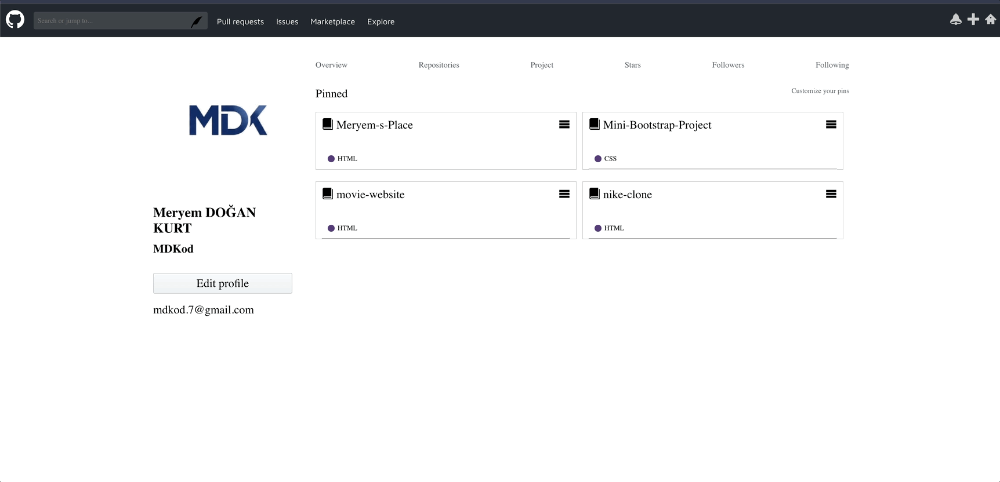

 🐙GitHub Clone 

This project is a **GitHub homepage clone** built using **HTML, CSS, and SCSS**  
The goal of this project is to practice frontend development skills and improve SCSS structure while recreating a modern, clean UI.

---

🛠️ Technologies Used

-  **HTML5**  
-  **CSS3**  
- **SCSS (Sass)**  

---

 📸 Screenshot

 

